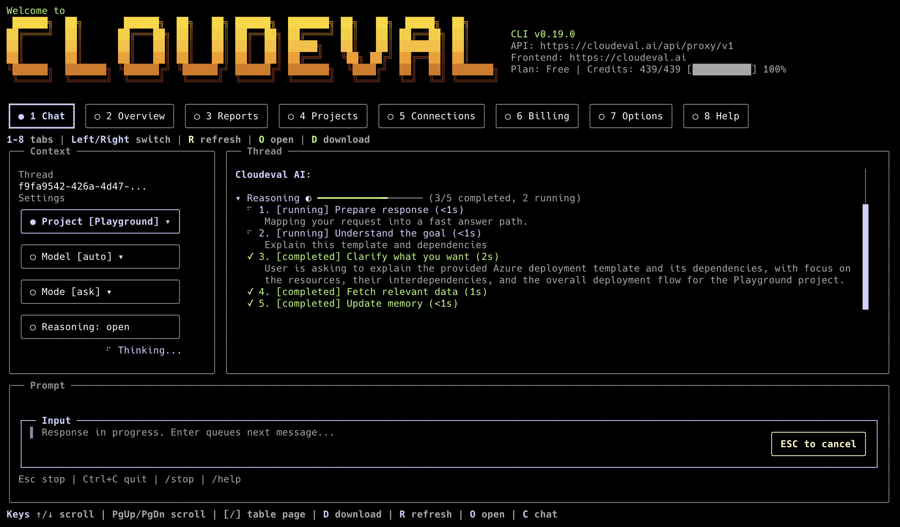

<p align="center">
  
</p>

# CloudEval CLI

**Your cloud, in the terminal: evaluated, reported, and agent-ready.**

[](https://github.com/ganakailabs/cloudeval-cli/releases/latest)
[](https://www.npmjs.com/package/@ganakailabs/cloudeval-cli)
[](https://www.npmjs.com/package/@ganakailabs/cloudeval-cli)
[](https://github.com/ganakailabs/cloudeval-cli/releases)
[](https://github.com/ganakailabs/cloudeval-cli/actions/workflows/semantic-release.yml)
[](https://cloudeval.ai)
[](https://docs.cloudeval.ai/quickstart/use-the-cli.md)
[](https://discord.gg/tk5dcU2a7T)
[](https://github.com/ganakailabs/cloudeval-cli/issues)
[](https://github.com/ganakailabs/cloudeval-cli/blob/main/AGENTS.md)

CloudEval CLI turns **ARM templates**, **GitHub-hosted IaC**, and **live Azure context** into cost, architecture, and Well-Architected signals. Use it as a terminal UI, a scriptable automation client, or an MCP server for Codex, Cursor, Claude, VS Code, and any stdio JSON-RPC client.

## Why Use It

| For                | What you get                                                                                                                      |
| ------------------ | --------------------------------------------------------------------------------------------------------------------------------- |
| **Terminal users** | A full TUI with chat, Agent mode, workspace tabs, thread switching, slash commands, a context rail, task ledger, artifact chips, and local SQLite session history. |
| **Automation**     | Stable `json`, `ndjson`, `markdown`, and text output; payloads on stdout; progress and prompts on stderr; predictable exit codes. |
| **Agents and CI**  | Scoped access-key credentials, redacted output by default, MCP toolsets, recipes, and machine-readable capability metadata.       |

## Install

Node.js 20+ users can install from npm:

```bash
npm install -g @ganakailabs/cloudeval-cli
cloudeval --help
```

macOS, Linux, WSL2, Git Bash, and PowerShell 7+ on Windows or Linux can use
the standalone release installer:

```bash
curl -fsSL https://cli.cloudeval.ai/install.sh | bash
```

```powershell
irm https://cli.cloudeval.ai/install.ps1 | iex
```

Then reload your shell and sign in:

```bash
source ~/.bashrc   # or: source ~/.zshrc
cloudeval login
cloudeval status
cloudeval chat
```

Device login goes through **cloudeval.ai** and always asks the browser auth
provider to show the account chooser, so users can choose the intended work
email even when another account is already signed in. No local Azure app
registration is needed for normal CLI use.

<details>
<summary><strong>Installer behavior and controls</strong></summary>

The installer:

- downloads checksum-verified GitHub release assets and installs `cloudeval`;
- creates the `eva` and `cloud` aliases on non-Windows platforms;
- can install shell completions for bash, zsh, and fish;
- can offer concise MCP setup for detected Codex, Claude Desktop, Cursor, and VS Code clients, skipping clients where CloudEval MCP is already configured and avoiding prompts when only manual-only setup remains;
- asks whether to share limited CLI telemetry, defaulting to yes; declining writes `telemetry.enabled=false`;
- explains credential setup but does not create access keys or write secrets into MCP client config;
- shows compact labeled progress bars in interactive terminals;
- uses connect/stall timeouts so slow CDN transfers fail clearly.

Useful controls:

```bash
curl -fsSL https://cli.cloudeval.ai/install.sh | CLOUDEVAL_INSTALL_AGENT_SETUP=0 bash
curl -fsSL https://cli.cloudeval.ai/install.sh | CLOUDEVAL_INSTALL_MCP_CLIENTS=codex,cursor bash
curl -fsSL https://cli.cloudeval.ai/install.sh | CLOUDEVAL_TELEMETRY=0 bash
```

```powershell
$env:CLOUDEVAL_ASSUME_YES = "1"
irm https://cli.cloudeval.ai/install.ps1 | iex
```

The bash installer can also detect agent clients and offer MCP setup. The
PowerShell installer installs the verified binary, `yoga.wasm`, license
notices, PATH, and optional PowerShell tab completions. Run `cloudeval mcp
setup` afterward when you want MCP client configuration.

</details>

## Telemetry

CloudEval CLI sends curated custom events to Azure Application Insights by
default. Events cover command family, success, duration, safe option enums, CLI
version, Node/runtime version, OS major version, architecture, install source,
update/install outcomes, MCP tool names, and TUI launch/exit metadata. After
login, events may include the signed-in email and first/last/full name.

Telemetry never sends raw prompts, command output, tokens, local paths, project
or resource identifiers, account/session/tenant identifiers, cloud resource
names, stack traces, or raw error messages. Disable or re-enable it anytime:

```bash
cloudeval config set telemetry.enabled false
cloudeval config get telemetry.enabled --format json
cloudeval config set telemetry.enabled true
cloudeval config unset telemetry.enabled
```

Environment overrides take precedence for a single run:

```bash
CLOUDEVAL_TELEMETRY=0 cloudeval status --format json
CLOUDEVAL_TELEMETRY=1 cloudeval --help
```

Update later with:

```bash
cloudeval update --check
cloudeval update --yes
```

After an update, restart or reload configured MCP clients when you are ready to
load newly exposed CloudEval tools, resources, or prompts. CloudEval does not
restart Codex, Claude, Cursor, VS Code, or other MCP hosts automatically.

Uninstall local installer-owned artifacts while keeping CloudEval config,
sessions, and auth by default:

```bash
cloudeval uninstall --dry-run
cloudeval uninstall --yes
cloudeval uninstall --yes --remove-config  # also removes ~/.config/cloudeval
npm uninstall -g @ganakailabs/cloudeval-cli # if installed through npm
```

## Start Here

```bash
cloudeval                         # Terminal UI
cloudeval ask "Summarize my cloud risk" --format json
cloudeval agent "Find cost and architecture risks" --format json
cloudeval agents list
cloudeval agents run cost --project <project-id> --format json
cloudeval recipes list
cloudeval projects list
cloudeval uninstall --dry-run
cloudeval projects graph insights <project-id> --focus impact --resource <resource-id> --format json
cloudeval validate template --template-file template.json --parameters-file parameters.json --rule <check-id> --details --wait --progress stderr --wait-timeout 600000 --format json
cloudeval validate tests --template-file template.json --parameters-file parameters.json --wait --progress stderr --wait-timeout 600000 --format json
cloudeval rules search "public network" --format json
cloudeval reports list
cloudeval actions list --type architecture,cost,unit-tests --format json
cloudeval actions open --print-url --no-open
cloudeval capabilities --format json
cloudeval doctor --deep
```

Full docs: [Use the CLI](https://docs.cloudeval.ai/quickstart/use-the-cli.md) and [CLI command reference](https://docs.cloudeval.ai/reference/cli-command-reference.md).

Inside the Terminal UI, use the Thread control or `/thread` to switch open chat
sessions, recent CloudEval chat threads, and local CLI sessions. `/thread new`
starts another independent open session, and `/open` jumps to the same chat
thread in CloudEval when the active session has a thread id. Roomy terminals show
a context rail with project, thread, model, mode, profile, report artifact
chips; narrower terminals keep the
chat first and expose the same controls through the composer and slash commands.
Typing `/` opens a bottom command completion strip; use Tab or Up/Down to move,
Right to accept the ghost text, and Enter to choose the highlighted command.
Streaming work appears as a task ledger in the thread, and the bottom composer
stays docked so prompt entry does not compete with the transcript. Grounded
answers show numbered citations and a Sources section instead of raw
`[S_tool_...]` tags, with citation numbers highlighted inline; `/copy` copies
the latest assistant response and `/download` writes a Markdown transcript with
the same references. Project and Connection tabs show a selected-item detail
pane for backend fields, report coverage, sync state, and linked records; use
`J`/`K` or Up/Down on Projects and Connections to move the selected row, then
Enter to confirm it. The billing header separates credits left from observed
credits used so usage does not look like the current budget. Use the Profile
control or `/profile cost` to run the current prompt with an Agent Profile;
selecting a profile switches the TUI to Agent mode, and selecting Ask mode
clears the profile back to the default chat flow. Starter prompts stay hidden
until you run `/starter`. Press `Esc` from the prompt to leave text editing so
tab, arrow, and number shortcuts move through controls and tabs; type again to
resume editing. Busy loaders and the input cursor can be disabled with
`--no-anim`. The banner details
include the logged-in user. Focused controls and the active top tab use the
shared warm banner-yellow accent, with the active tab filled across its full
button interior.

## Core Workflows

| Goal                 | Terminal UI                         | Script or CI                          | MCP                       |
| -------------------- | ----------------------------------- | ------------------------------------- | ------------------------- |
| Grounded cloud chat  | `cloudeval` or `cloudeval chat`     | `cloudeval ask "..." --format json`   | `ask`                     |
| Deeper analysis      | Agent mode in the TUI               | `cloudeval agent "..." --format json` | planner-style tool flows  |
| Agent Profiles       | TUI Profile control and Chat picker | `cloudeval agents list/show/run`      | `agent_profiles_*` tools  |
| Reusable workflow    | prompt suggestions                  | `cloudeval recipes list/show/run`     | `recipes_*` tools         |
| Projects and reports | workspace panels                    | `projects`, `reports`, `open`         | `projects_*`, `reports_*` |
| Issues               | `/app/issues`                       | `actions list/get/open`               | n/a                       |
| Graph intelligence   | project graph views                 | `projects graph ...`                  | `projects_graph_*` tools  |
| Template validation  | n/a                                 | `validate`, `rules`                   | `template_*`, `rules_*`   |
| Billing              | billing panel and links             | `billing`, `credits`                  | `billing_*` toolset       |
| Automation discovery | n/a                                 | `capabilities --format json`          | `capabilities_get`        |

Agent Profile ids and display names are single-word labels: `architecture`,
`cost`, `triage`, and `remediation`. The Architecture profile includes the
Well-Architected review lens, so there is no separate Well-Architected Agent
Profile. When `agents run` omits a prompt, the CLI uses a starter prompt for
the selected project source and profile mode: template or live sync, ask or
agent. The choice is deterministic for automation. Profile runs send only
`agent_profile_id`; CloudEval applies profile instructions, planning lens, and
response defaults on the backend. `agents list` and `agents show` first try the
backend profile catalog; if the profile catalog endpoint requires sign-in or is
not available, they fall back to the bundled public catalog so discovery still
works. `agents run` still requires authenticated backend access. In the TUI,
the Profile selector uses the same canonical IDs and sends the selected
`agent_profile_id` with chat streams.

Run `cloudeval <command> --help` for exact flags.

## Access Keys For CI And Agents

Use `cloudeval login` for humans. The browser approval page requests an
account chooser on every login. Use scoped access keys for CI, hosted agents,
and long-running automation.

Stored device-login sessions refresh automatically before authenticated
requests. If the TUI or `cloudeval ask` receives an expired-token response from
the chat stream, the CLI refreshes the stored session and retries that request
once. If the refresh token is revoked or expired, run `cloudeval login` again.

Create an access key after login and project selection:

```bash
cloudeval projects list
cloudeval credentials templates --format json
cloudeval credentials create \
  --template ci \
  --name github-actions-prod \
  --project <project-id> \
  --expires 90d \
  --idempotency-key "$(uuidgen)" \
  --format github-actions
```

`--format github-actions` prints `CLOUDEVAL_ACCESS_KEY` and `CLOUDEVAL_PROJECT_ID` once. The raw key is not shown again by `credentials list` or `credentials inspect`.

Test a scoped access key without putting it in shell history:

```bash
printf '%s\n' "$CLOUDEVAL_ACCESS_KEY" | cloudeval projects list \
  --access-key-stdin \
  --format json \
  --non-interactive
```

Credential rules:

- prefer `--access-key-stdin` or `CLOUDEVAL_ACCESS_KEY`;
- `--access-key` is accepted but warns because process arguments and shell history can leak;
- old beta names `--api-key`, `--api-key-stdin`, and `CLOUDEVAL_API_KEY` fail with a migration error;
- access-key-shaped strings, authorization headers, and sensitive URL query parameters are redacted by default;
- credential create output files are written with private permissions on POSIX systems.

## MCP For Coding Agents

Start MCP after signing in, or provide a scoped `CLOUDEVAL_ACCESS_KEY` in the host environment:

```bash
cloudeval login
cloudeval mcp serve
cloudeval mcp serve --toolset readonly
```

Client setup examples:

```bash
codex mcp add cloudeval -- cloudeval mcp serve --toolset readonly
cloudeval mcp setup cursor --dry-run --toolset reports --format json
cloudeval mcp setup vscode --dry-run --toolset readonly --format json
```

MCP rules:

- tool names use underscores such as `projects_list`, `recipes_list`, and `billing_summary`;
- dotted tool names remain compatibility aliases;
- stdout is JSON-RPC only and `[cloudeval-mcp]` diagnostics go to stderr;
- MCP tool schemas do not accept per-call access-key arguments;
- `mcp serve` does not support `--access-key-stdin` because stdin is the protocol stream.
- `readonly` includes safe inspection tools for projects, reports, billing, connections, credentials, config, models, sessions, auth, status, doctor, and recipes; generation, downloads, checkouts, credential mutation, browser opens, and diagram file writes stay explicit.

Developer setup details: [cli.cloudeval.ai/developer/](https://cli.cloudeval.ai/developer/).

## Recipes And Skills

CloudEval recipes are reusable workflows for agents and humans. Current recipes cover cost review, WAF triage, architecture review, template project review, report summaries, report generation planning, report export packs, billing review, top-up readiness, project inventory and healthchecks, connection audit, credential setup and rotation, model selection, session recovery, CLI onboarding checks, frontend workspace links, architecture/dependency diagram exports, and MCP setup.

```bash
cloudeval recipes list
cloudeval recipes show cloudeval-cloud-cost-review
cloudeval recipes run cloudeval-cloud-cost-review --project <project-id> --format json --non-interactive
cloudeval recipes show cloudeval-architecture-diagram-export
cloudeval recipes run cloudeval-dependency-diagram-export --project <project-id> --output-path ./dependency.svg
```

Ask/agent-backed recipes may consume model credits. Recipes that would create projects, write report or diagram files, change MCP config, mutate credentials, open browsers, or start checkout flows print explicit commands instead of performing those side effects implicitly. Portable agent instructions live under [`skills/`](skills/); MCP remains the preferred execution path for Codex, Cursor, Claude, and other agents.

## Project Example

```bash
curl -L -o template.json \
  https://raw.githubusercontent.com/Azure/azure-quickstart-templates/master/quickstarts/microsoft.compute/1vm-2nics-2subnets-1vnet/azuredeploy.json

cloudeval projects create \
  --name "Azure VM network review" \
  --provider azure \
  --template-file ./template.json \
  --format json
```

Use `--template-url` when you do not want a local file. Follow with `reports run`, `reports download`, and `projects export-diagram` as needed.

## Output, Auth, And Privacy

```bash
cloudeval login
cloudeval login --headless
cloudeval auth status
cloudeval auth status --show-sensitive-ids
cloudeval help agents
cloudeval agents list
```

Output contract:

- `cloudeval login` opens or prints a `cloudeval.ai/device/login` approval URL
  with an account chooser hint for the web auth provider;
- machine-readable commands write payloads to stdout;
- prompts, progress, browser-open messages, and warnings go to stderr;
- `ask` and `agent` support `--progress none`, `--quiet`, or `--format ndjson --progress ndjson`;
- `validate template` and `validate tests` support `--progress stderr` or
  `--progress ndjson` with `--wait`; validation progress always goes to stderr
  so final JSON/NDJSON remains parseable on stdout. Completed progress includes
  failing check/test details such as message, recommendation, severity, and
  file/template or resource location when available. If a completed backend
  result only has a worker-local temp file path, CloudEval reports the submitted
  template filename instead;
- with `--non-interactive`, human approval exits with code `6` and returns `HITL_REQUIRED`;
- `--show-sensitive-ids` shows full account/session-style IDs only on trusted machines. It does not unredact tokens.

## Docs

| Link                                                                                            | Purpose                                                       |
| ----------------------------------------------------------------------------------------------- | ------------------------------------------------------------- |
| [Use the CLI](https://docs.cloudeval.ai/quickstart/use-the-cli.md)                              | Install, login, create a project, and ask a grounded question |
| [CLI command reference](https://docs.cloudeval.ai/reference/cli-command-reference.md)           | Full command and flag list                                    |
| [Terminal UI](https://docs.cloudeval.ai/reference/terminal-ui.md)                               | TUI navigation and keyboard model                             |
| [MCP client setup](https://docs.cloudeval.ai/reference/mcp-client-setup.md)                     | Codex, Cursor, Claude, VS Code, and generic MCP hosts         |
| [Agent and automation rules](https://docs.cloudeval.ai/reference/agent-and-automation-rules.md) | Safe automation conventions                                   |
| [Troubleshooting](https://docs.cloudeval.ai/troubleshooting/sign-in-and-onboarding.md)          | Sign-in, onboarding, reports, and billing                     |

## Build From Source

Read [AGENTS.md](AGENTS.md) before touching auth, credentials, smoke artifacts, or user-facing command behavior.

```bash
git clone https://github.com/ganakailabs/cloudeval-cli.git
cd cloudeval-cli
pnpm install
pnpm build
pnpm -C packages/cli dev --help
```

Build a standalone binary for the current OS:

```bash
pnpm --filter @ganakailabs/cloudeval-cli build:executable:current
./packages/cli/dist/bin/cloudeval --help
```

Run checks:

```bash
pnpm lint
pnpm test
pnpm test:npm-package
(cd packages/cli && npm pack --dry-run)
pnpm -C packages/cli test:cli:noninteractive
pnpm security:scan
```

## Community

- [CloudEval app](https://cloudeval.ai)
- [Docs](https://docs.cloudeval.ai/)
- [Releases](https://github.com/ganakailabs/cloudeval-cli/releases)
- [Issues](https://github.com/ganakailabs/cloudeval-cli/issues)
- [Discord](https://discord.gg/tk5dcU2a7T)

## License

CloudEval CLI is proprietary software provided under the [CloudEval CLI License](LICENSE).
Production third-party package attribution is tracked in
[THIRD_PARTY_NOTICES.md](THIRD_PARTY_NOTICES.md), with a release SBOM in
[sbom.spdx.json](sbom.spdx.json). Published installer releases also download
these notice files under `~/.local/share/cloudeval/licenses`. The release
policy is documented in [License compliance](docs/license-compliance.md).
