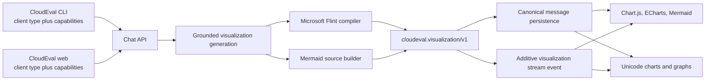
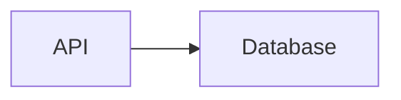

# Terminal Visualization Artifacts Design

## Goal

Make CloudEval chat visualizations portable across the web frontend and CLI. The
backend will identify the requesting client, negotiate explicit rendering
capabilities, generate one grounded and versioned visualization artifact, and
stream a representation that each client can render without changing the
meaning of the saved conversation.

This release covers Microsoft Flint charts and Mermaid diagrams. The existing
web rendering behavior remains backward compatible, while the CLI gains native
terminal chart and diagram output with deterministic text fallbacks.

## Decisions

1. Client identity is a routing hint, not an authorization signal. The existing
   `X-Client-Type` header selects defaults, while request capabilities decide
   which artifact formats may be returned.
2. The backend owns data grounding, chart selection, Flint compilation,
   artifact validation, and fallbacks. Clients own final presentation.
3. CloudEval persists canonical Markdown plus semantic artifact data. It never
   persists terminal escape sequences, terminal-width-specific ASCII, or a
   browser-only canvas as the source of truth.
4. Existing `chart` and `mermaid` fences remain readable. New Flint chart
   artifacts use a `flint` fence and a versioned JSON envelope.
5. A completed artifact is also emitted as an additive structured stream event.
   Clients that do not understand the event continue consuming Markdown.
6. Warp's `mermaid-to-svg` is not bundled in this release. It has no published
   release or package, produces SVG rather than terminal output, and would
   require per-platform native sidecars plus a raster/image-protocol layer.
   The first CLI release renders supported Mermaid flowcharts as deterministic
   Unicode graphs and falls back to an edge list or source. The artifact contract
   leaves room for an optional native SVG renderer later.

## Architecture



Microsoft Flint is used as a semantic compilation layer in the Python backend.
The backend invokes `flint-chart@0.3.0` through the Node runtime
already present in the production container. Flint compiles the same validated
rows and encodings into Chart.js or ECharts configuration. The original rows
and encodings remain in the artifact so non-browser clients do not need to
reverse-engineer a renderer-specific configuration.

## Request capability contract

`ChatRequest` gains an optional `presentation` object:

```json
{
  "presentation": {
    "profile": "terminal",
    "artifact_schema": "cloudeval.visualization/v1",
    "accepts": ["flint-v1", "mermaid-v11", "gfm-table"],
    "fallbacks": ["terminal-text", "plain-markdown"]
  }
}
```

Validation rules:

- `profile` is `terminal`, `web`, or `plain`.
- `accepts` and `fallbacks` are bounded lists of known identifiers. Unknown
  identifiers are ignored rather than becoming prompt text.
- `X-Client-Type: cloudeval-cli` defaults to `terminal`; `cloudeval-web`
  defaults to `web`; missing or unrecognized values default to `plain`.
- An explicit valid `presentation.profile` overrides the header default.
- Client type and presentation capabilities never affect authentication,
  tenant selection, project access, evidence retrieval, or billing.
- CLI and web versions are sourced from their real package/build version rather
  than the current hard-coded `0.1.0` header value.

The web client advertises `flint-v1`, `mermaid-v11`, and legacy `chartjs-v4`.
The CLI advertises `flint-v1`, `mermaid-v11`, and terminal text fallbacks.
Older clients that send no capabilities receive the existing Markdown contract.

## Canonical artifact contract

### Flint chart

```json
{
  "schema": "cloudeval.visualization/v1",
  "version": 1,
  "id": "viz_01",
  "kind": "chart",
  "format": "flint",
  "title": "Monthly cost by service",
  "description": "Grounded in the selected project's cost rows.",
  "renderer": "chartjs",
  "data": {
    "values": [
      { "service": "Compute", "cost_usd": 125 },
      { "service": "Storage", "cost_usd": 40 }
    ]
  },
  "spec": {
    "chartType": "Bar Chart",
    "encodings": {
      "x": { "field": "service", "type": "nominal" },
      "y": { "field": "cost_usd", "type": "quantitative" }
    }
  },
  "config": {
    "type": "bar",
    "data": {}
  },
  "fallback": {
    "kind": "table",
    "columns": ["service", "cost_usd"],
    "rows": [["Compute", 125], ["Storage", 40]]
  },
  "warnings": [],
  "evidence_refs": []
}
```

The artifact is fenced as `flint` in canonical assistant Markdown. The backend
sets `data`, `spec`, `config`, and `fallback`; the language model may only
propose a compact chart intent using fields present in grounded rows. It cannot
inject JavaScript functions, renderer callbacks, arbitrary modules, or terminal
control sequences.

Limits are enforced before compilation and streaming: at most 200 rows, 20
fields, bounded titles/descriptions, simple field names, JSON-only values, and
a short compiler timeout. Compilation failure returns the table fallback and
does not fail the chat answer.

### Mermaid diagram

Canonical Markdown continues to contain raw Mermaid source:

````markdown

````

The structured stream event wraps it as:

```json
{
  "schema": "cloudeval.visualization/v1",
  "version": 1,
  "id": "viz_02",
  "kind": "diagram",
  "format": "mermaid-v11",
  "title": "Request path",
  "source": "flowchart LR\n    API --> Database",
  "fallback": {
    "kind": "edge-list",
    "edges": [["API", "Database"]]
  },
  "warnings": [],
  "evidence_refs": []
}
```

Deterministic topology generation remains preferred when graph rows contain
`source`, `target`, and relationship data. Unsupported or malformed Mermaid is
contained to the artifact and never crashes the transcript.

## Streaming and persistence

The normal `responding` stream continues to carry Markdown so deployed and
older clients remain functional. After a complete `flint`, `chart`, or
`mermaid` fence is available, the backend emits one additional chunk:

```json
{
  "type": "visualization",
  "artifact": {
    "schema": "cloudeval.visualization/v1",
    "version": 1,
    "kind": "chart"
  }
}
```

The event is emitted only for a fully validated artifact and is deduplicated by
artifact ID. Partial streamed fences do not generate events. Unknown clients
may ignore the chunk.

Canonical Markdown is still persisted with the assistant message. This keeps
thread history portable without a database migration. When a client reloads a
historical message that lacks structured events, it reconstructs artifacts from
complete fences. A later schema migration may persist artifacts separately,
but it is not required for this release.

## Frontend behavior

The existing Chart.js and Mermaid paths remain intact. The frontend adds:

- `flint` fence parsing and strict `cloudeval.visualization/v1` validation;
- Chart.js rendering when `renderer` is `chartjs`;
- ECharts rendering when `renderer` is `echarts`;
- loading containment for partial fences and an accessible fallback card for
  malformed artifacts;
- capability advertisement on chat requests;
- deduplication between a structured visualization event and its Markdown
  fence.

Legacy `chart` fences continue to render. The rollout order puts this frontend
compatibility release before backend Flint generation, so an older backend and
new frontend remain compatible throughout deployment.

## CLI behavior

The CLI stream client preserves `visualization` events on the assistant message.
The transcript renderer also parses complete fences for historical messages and
older backends.

Charts render from artifact rows and encodings, not from browser configuration:

| Flint shape | Terminal rendering |
| --- | --- |
| line, area, stepped line | `asciichart` line plot plus legend |
| bar, grouped bar, stacked bar | bounded Unicode block bars |
| pie, doughnut, rose, radar, polar | ranked proportional bars plus values |
| scatter, bubble | bounded character grid; table on insufficient dimensions |
| heatmap | shaded Unicode matrix |
| Sankey, network, tree, treemap, Gantt, unsupported | semantic table or edge-list fallback |

Mermaid V1 supports `flowchart` and `graph` statements, common node labels,
directed and undirected edges, and edge labels. It renders a deterministic
Unicode node/edge view sized to the current transcript width. Other diagram
types use the backend edge-list fallback when present and otherwise show a
compact source card.

All renderers obey terminal width, `NO_COLOR`, and existing CloudEval theme
tokens. They never emit raw control characters from artifact labels. Invalid
artifacts show `Visualization unavailable` and their safe fallback instead of
throwing from Ink.

## Compatibility and rollout

Deployment is ordered to keep every intermediate state usable:

1. Frontend compatibility: deploy `flint` parsing/rendering and capability
   advertisement. Existing backend `chart` and `mermaid` fences still work.
2. Backend contract: deploy Flint compilation, negotiation, canonical artifacts,
   structured events, and legacy fallback behavior.
3. CLI release: publish the next semantic version with capability advertisement
   and terminal renderers. Older CLI versions continue showing fences as code.

The CLI currently releases through semantic-release from `main`; a `feat` commit
will select the next semantic version automatically and the existing workflow
publishes GitHub binaries and the npm package. The backend and frontend are
applications rather than public semver packages, so their released versions are
deployment revisions identified by commit SHA. Their existing main-branch
workflows remain the release mechanism.

## Testing and acceptance

Backend tests cover:

- client profile and capability resolution;
- request validation and safe defaults;
- Flint input assembly, row limits, semantic annotations, and field validation;
- Chart.js and ECharts compilation using pinned Flint fixtures;
- compiler timeout/failure fallback;
- complete-fence extraction, structured event emission, and deduplication;
- legacy clients receiving compatible Markdown;
- deterministic Mermaid artifacts from topology rows.

Frontend tests cover:

- strict Flint artifact parsing;
- Chart.js and ECharts selection;
- partial/malformed fence containment;
- legacy `chart` and Mermaid regressions;
- capability payloads and event/fence deduplication.

CLI tests cover:

- capability payload and real version headers;
- visualization event reduction and historical fence recovery;
- chart render snapshots at narrow and wide terminal widths;
- Mermaid flowchart parsing, labels, edge directions, and malformed input;
- `NO_COLOR`, control-character sanitization, and fallback behavior;
- help/status smoke and packaged executable smoke.

Release acceptance requires fresh targeted tests, complete repository test/build
commands appropriate to each changed surface, documentation checks, clean diffs,
successful CI/deployment workflows, the published CLI package/version, and a live
chat opened on both web and CLI using the same thread. Fixture-backed rendering
does not substitute for that final live contract check.

## Documentation

- Backend: update `docs/guides/chat-streaming.md`,
  `docs/guides/visualization-generation.md`, and
  `docs/guides/testing-and-release-quality.md`.
- Frontend: update `docs/guides/streaming-and-thinking-events.md`,
  `public/llms.txt`, and `public/llms-full.txt`; regenerate the search index.
- CLI: update root `README.md`, `packages/cli/README.md`, and
  `docs/release-smoke-tests.md` with human and structured behavior.

## Non-goals

- Rendering SVG directly in every terminal.
- Shipping Warp's unversioned Rust repository as a mandatory runtime sidecar.
- Replacing the frontend's Chart.js, ECharts, or Mermaid libraries.
- Allowing client identity to alter evidence, authorization, or answer truth.
- Supporting every Mermaid diagram type or every Flint template visually in the
  first terminal renderer.
- Adding a visualization database migration in this release.
